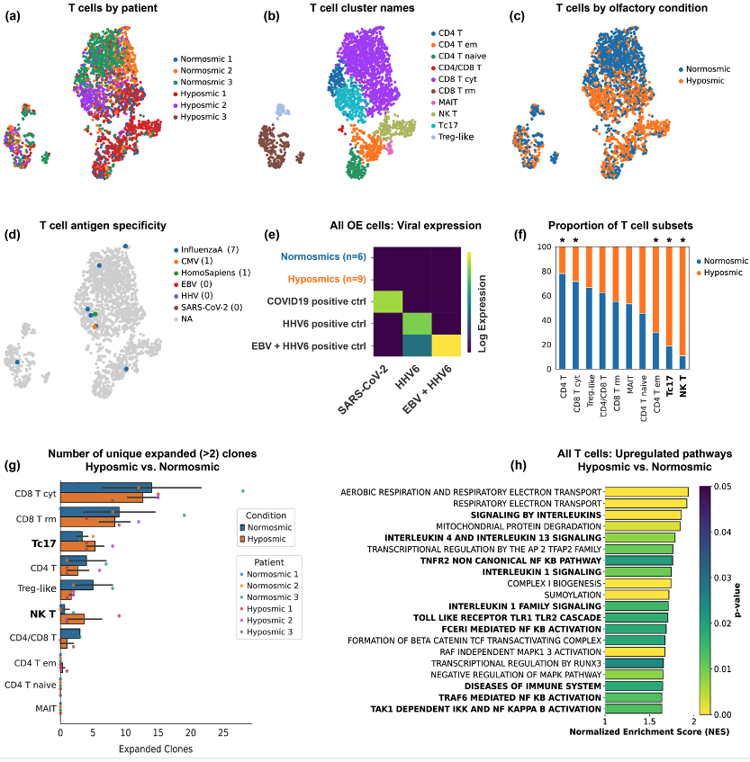

# Analysis of local mucosal immune dysregulation to guide pilot directed therapy for long-COVID olfactory loss

Each file is a separate Jupyter lab notebook to replicate Figure 1 components. 

# Figure 1. T cell composition, clonal expansion, antigen specificity, and pathway
# enrichment differences between long-Covid hyposmic subjects and normosmic controls.
(a) T cell subset identified by scRNA-seq from biopsies, visualized by UMAP colored by subjects
(Normosmic 1-3, COVID-hyposmic 1-3), (b) T cell cluster identities and (c) cell composition
colored by olfactory condition. (d) UMAP projection of T cells, with color indicating the TCR’s
matching antigen species from the VDJdb. Legend shows the antigen species and the number of
matching TCR sequences. (e) Expression of HHV4, HHV6, and SARS-CoV2 viral transcripts in
samples or positive controls. Zero viral transcripts were identified in normosmics or COVID-
hyposmics. (f) Visualization of T cell composition by olfactory condition; * p < 0.001, Fisher’s exact
test with FDR correction. (g) Number of unique expanded (>2) clones by T cell subset and
olfactory condition. Error bars show standard error of the mean for each condition. Subsets
identified as significantly upregulated in hyposmics in (f) are also bolded in (g) to denote theirclonally expanded status. 
(h) Top significantly upregulated reactome transcriptional pathways
across all T cells from COVID-hyposmic biopsies relative to normosmic controls. Immunological
pathways are highlighted in bold; normalized enrichment scores (NES) indicate a heightened,
mixed inflammatory signature. CD8 T cyt = Cytotoxic CD8 T cells, Tc17 = IL-17-producing CD8+
T cells, CD8 T rm = Tissue resident CD8 T cells, CD4 T em = Effector memory CD4 T cells, NKT
= Natural killer T cells, Treg-like = Regulatory T-like cells, MAIT = Mucosal associated invariant T
cells

